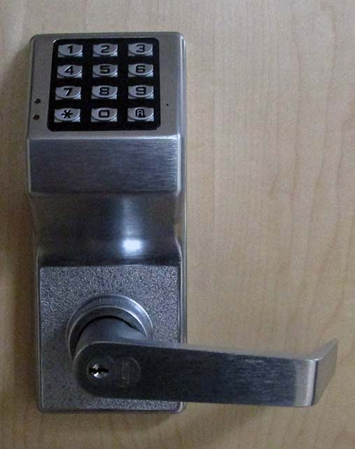
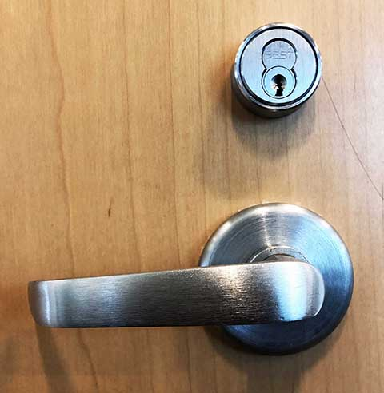

# Different types of door locks

## Door Codes 

- All you need to know is the code.
- Message the appropriate coordinators to get the code
- Both Hawkins and Psychology use codes for their classrooms

## Key Lock 

- There is a master key that coordinators can use but they have to check it out of General Services
- The most common type of lock

## Swipe Cards 

- A card has to have sufficient permission to be let in

