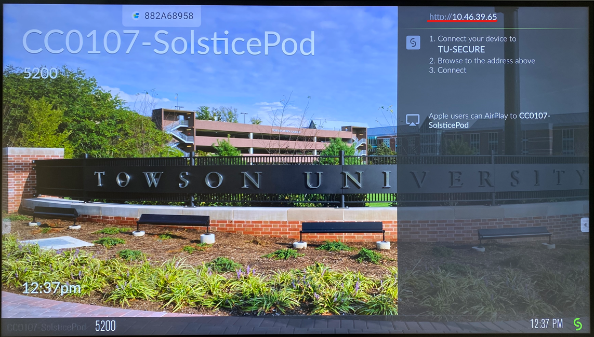
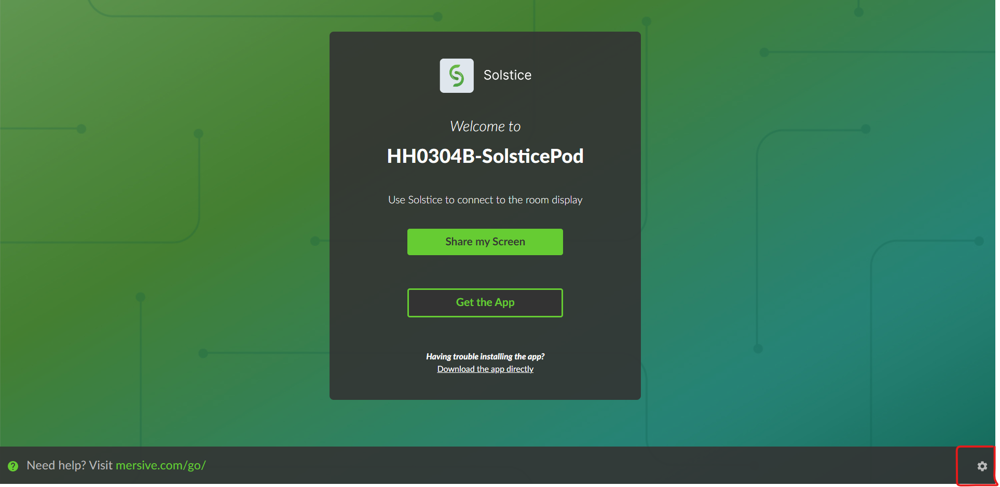

# Installing/Replacing a new Solstice Pod

## What to do before

- Ask Ben for admin password
- Have a separate device that's connected to 'tu-secure'

## Steps

1. Connect the Solstice Pod using a network cable.
2. Connect the HDMI cable to the slot in the back, labeled "HDMI 1" up top and "4k" at the bottom
3. Switch to the appropriate input
4. Open a browser from your other device and visit the IP address shown
   
5. Click the cog button
   
6. Go to the 'Updates' tab
   1. Run the update and chill
   2. If there are no updates, move on
7. Go to the 'Display tab
   1. Set 'Display Name" to <CollectionCode-SolsticePod\> e.g. `HH0304B-SolsticePod`
   2. Set "Timezone" to Eastern Time
   3. Set "Host Name" to match the display name from the previous steps
   4. Set "Admin Password" to the admin password you were given.
    - No typos, else that pod is toast
8. Go to the "Network" tab and uncheck "Enable" under "Wireless Settings"
