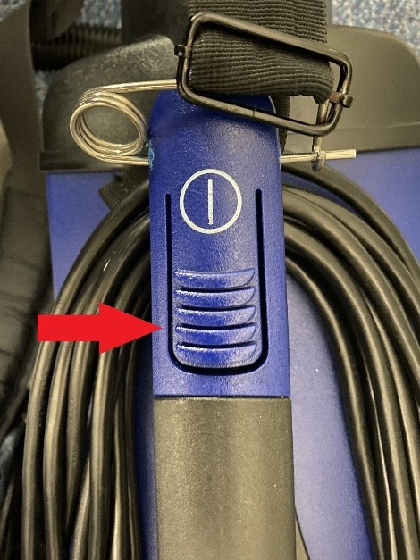

# Vacuuming Projectors

- Projectors get hot, so it comes with a fan
- Fans also suck in dust
- Dust blocks airflow, so there's less ventilation
- Projectors that have a hard time cooling themselves will show a temperature warning and the fans will have to run much louder

## Carrying the vacuum

- There's a shoulder strap to put around yourself.
- You will bump into things carrying it. Just make sure you don't bump into anything expensive or anyone.

## Powering on the vacuum

1. Plug the vacuum power plug into a nearby outlet.
  - Some classrooms have outlets on the ground.
  - Don't knock stuff down because of the power cord getting caught.
2. The power button is located at the top of the handle.
  - Look for this button    
  

## Extending the vacuum nozzle

1. Push the slide up.
2. Extend the nozzle by hand.
   - If it doesn't extend, play with the extension part around.  

### Longer extensions

- Some rooms (mostly Center for the Arts) have projectors really high up.
- The extensions aren't perfect, so you'll have to MacGyver it
  - Extensions will be provided when required.

## What to vacuum

1. Look for any ventilation on the sides, back and front

2. Carefully point the nozzle at any of the vents

- Dust should start to get sucked in

- Make sure not to bump the projector

3.	Repeat until all vents are cleaned

## Testing the projector

After you vacuumed the projector, it's best to ensure that the warning doesn't show up. Honestly, as long as it looks clean, you're good to go.

1. Start the system by pressing start on the Crestron panel.  
  
  - If it prompts for a source, click "Projector" 
2. Let the projector run for a couple of minutes
  - If there are no temperature warnings, then there's no problem. Good job.
3. Click "Finish" on the Crestron panel to turn the system off.  
  
